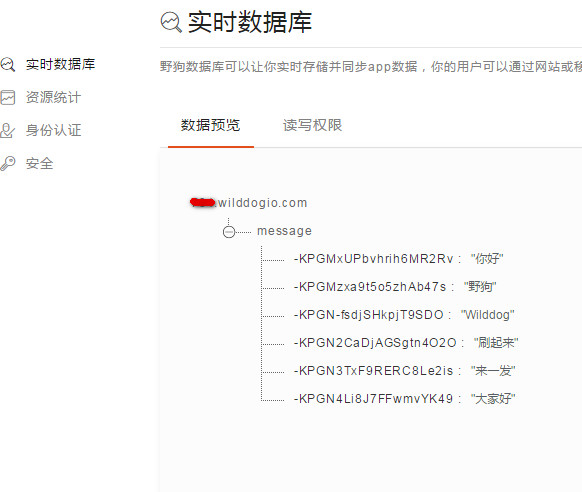

title: 实战教程
---

本部分内容将给出一些详尽的示例教程。一些基础教程如创建应用、读写数据这里不再重复，不了解的话请先阅读[快速入门](/sync/ios/quickstart.html)。

# 弹幕

## 示例说明
示例的最终的展示效果如下： 


野狗很适合做一些多端（web、iOS、android 等其他客户端）实时同步的应用，弹幕就是其中一个。使用 Wilddog SDK，百余行代码即可完全实现弹幕功能。可见 Wilddog 在实时领域的简单与强大。

## 具体步骤

### 引入 Wilddog iOS SDK 

SDK 的导入方式有两种，你可以选择下面方式的其中一种：

#### 第一种：使用 CocoaPods 
要将 Wilddog SDK 导入到你的工程中，推荐使用 [CocoaPods](https://cocoapods.org/)，如果没用过 CocoaPods，请先访问 [CocoaPods getting started](https://guides.cocoapods.org/using/getting-started.html)。 


打开工程目录，新建一个 Podfile 文件

	$ cd your-project-directory
	$ pod init
	$ open -a Xcode Podfile # opens your Podfile in XCode

然后在 Podfile 文件中添加以下语句

	pod 'Wilddog'
	
最后安装 SDK

	$ pod install
	$ open your-project.xcworkspace
	
#### 第二种：手动集成 

1、下载 SDK。[下载地址](https://cdn.wilddog.com/ios/client/sync/WilddogSync.framework-2.0.0Beta.zip)         
2、把 WilddogSync.Framework 拖到工程目录中。  
3、选中 Copy items if needed 、Create Groups，点击 Finish。  
4、点击工程文件 -> TARGETS -> General，在 Linked Frameworks and Libraries 选项中点击 '+'，将 JavaScriptCore.framework、 libsqlite3 加入列表中。


### 初始化

```
// 创建数据库引用。最好自己创建一个应用，把 danmu 即 `appId` 换成你自己的
_wilddog = [[Wilddog alloc] initWithUrl:@"https://danmu.wilddogio.com/message"];

```

### 发送弹幕
这里用到 Wilddog 写入数据的一个 API [childByAutoId](/sync/ios/guide/save-data.html#用childByAutoId追加新节点), 它用来在当前节点下生成随机子节点，以保证键的不重复和有序。

```
// 获取输入框的数据， 将数据写到云端 message 节点下，childByAutoId 用来定位子节点
- (BOOL)textFieldShouldReturn:(UITextField*)aTextField
{    
    [[self.wilddog childByAutoId] setValue:aTextField.text];
    
    [aTextField setText:@""];
    
    return NO;
}

```
数据库中的数据结构就是这个样子的：


### 设置监听
```
- (void)viewDidLoad 
{
    [super viewDidLoad];
    
    //初始化
    _wilddog = [[Wilddog alloc] initWithUrl:kWilddogUrl];
    
    _snaps = [[NSMutableArray alloc] init];
    _originFrame = self.view.frame;
    
    // 设置监听
    // 绑定 WEventTypeChildAdded 事件，当 message 节点下有子节点新增时，就会触发回调，回调的 snapshot 对象包含了新增的数据
    [self.wilddog observeEventType:WEventTypeChildAdded withBlock:^(WDataSnapshot *snapshot) {
        
        [self sendLabel:snapshot];
        [self.snaps addObject:snapshot];
        
    }];
    
    //添加定时器
    [NSTimer scheduledTimerWithTimeInterval:.5 target:self selector:@selector(timer) userInfo:nil repeats:YES];
}
```

### 取数据
```
//随机取出弹幕数据
- (void)timer
{
    if (_snaps.count < 2) {
        return;
    }
    int index = arc4random()%(self.snaps.count-1);
    WDataSnapshot *snapshot = [self.snaps objectAtIndex:index];
    [self sendLabel:snapshot];
}

```

### 在屏幕显示
`WDataSnapshot` 是野狗数据的一个快照，包含着正在监听的节点下，从云端数据取下来的数据。

```
//设置随机颜色，并显示在屏幕上
- (UILabel *)sendLabel:(WDataSnapshot *)snapshot
{
    float top = (arc4random()% (int)self.view.frame.size.height)-100;
    UILabel *label = [[UILabel alloc] initWithFrame:CGRectMake(self.view.frame.size.width, top, 100, 30)];
    label.textColor = [UIColor colorWithRed:arc4random()%255/255.f green:arc4random()%255/255.f blue:arc4random()%255/255.f alpha:1];
    label.text = snapshot.value;
    [UIView animateWithDuration:7 animations:^{
        label.frame = CGRectMake(-label.frame.size.width, top, 100, 30);
    }completion:^(BOOL finished){
        [label removeFromSuperview];
    }];
    [self.view addSubview:label];
    return label;
}
```


## 获取源码
本示例只是弹幕的一种简单实现方式，你可以开动大脑，做出更优雅的实现。
点此处获取[示例源码](https://github.com/WildDogTeam/demo-ios-danmu)。


